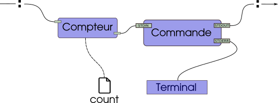

# TP2 - Compter les octets des redirections

L'objectif du TP2 est de développer l'utilitaire `tally` capable d'exécuter des conduites (*pipelines*) de commandes (comme le shell), mais aussi de comptabiliser le nombre d'octets qui transitent sur chacunes des redirections.
Ce TP vous permet d'approfondir la communication interprocessus avec les sockets UNIX (et l'appel système `socketpair`).

## Description de l'outil `tally`

### Usage

```
tally CMD [ARG]... [: CMD [ARG]...]...
```

`tally` exécute en parallèle une séquence de commandes. Les commandes sont séparées par le caractère deux-points `:` qui joue le rôle de redirection. Les redirections faites par `:` sont implémentées par les *socket UNIX* avec une communication locale. 
Ainsi, tout comme `|` dans une conduite (*pipeline*) shell, `tally` avec `:` relient les commandes entre elles.

La sortie standard d'une commande est donc redirigée vers l'entrée standard de la commande suivante.
L'entrée standard de la première commande correspond à l'entrée standard de `tally` et la sortie standard de la dernière commande correspond à la sortie standard de `tally` (habituellement le terminal dans les deux cas).
La sortie standard pour les messages d'erreur n'est pas modifiée.

Le nombre d'octets qui transitent par chaque redirection `:` est comptabilisé et est écrit dans un fichier `count` qui se trouvera dans le répertoire où s'exécutera `tally`. 
Pour chaque redirection `:` le fichier `count` contiendra une ligne avec les informations suivantes,
- l'ordre de la redirection dans la conduite (le compte commence à `1`),
- suivi des caractères ` : ` (un espace, `:` et un espace),
- puis le nombre d'octets qui ont transités par la redirection,
- un saut de ligne `\n` pour terminer la ligne.

### Valeur de retour

En cas de succès, `tally` retourne le code de retour de la dernière commande. Si la dernière commande n'existe pas, le code de retour est `127`. Si la dernière commande se termine à cause d'un signal, le code de retour est `128` + **numéro du signal**.

Dans tous les cas, le programme `tally` ne se termine que lorsque **toutes les commandes se sont terminées**.
À part pour la dernière commande, les valeur de retour des autres commandes ne sont pas prise en compte.

En cas d'échec lors de mise en place de la conduite ou de tout problème interne, `tally` doit s'arrêter immédiatement, la valeur retournée doit être `1` et aucun message ne doit être affiché.

### Exemples d'exécution

<p>

<details>

<summary>Illustration</summary>



</details>

</p>

<p>

<details>

<summary>Exemple 1</summary>

<pre>
<b>groot@iam:~/$</b> ls
nevermind   tally
<b>groot@iam:~/$</b> ./tally wc nevermind 
 125  379 1922 nevermind
<b>groot@iam:~/$</b> echo $?
0
<b>groot@iam:~/$</b> ls
nevermind   tally
<b>groot@iam:~/$</b> ./tally cat nevermind : grep left : wc -c
42
<b>groot@iam:~/$</b> ls
count   nevermind   tally
<b>groot@iam:~/$</b> cat count
1 : 1922
2 : 42
</pre>

</details>

</p>

<p>

<details>

<summary>Exemple 2</summary>

<pre>
<b>groot@iam:~/$</b> ls
nevermind   tally
<b>groot@iam:~/$</b> ./tally cat nevermind : grep left : wc -c fail 2> /dev/null
<b>groot@iam:~/$</b> echo $?
1
<b>groot@iam:~/$</b> ls
count   nevermind   tally
<b>groot@iam:~/$</b> cat count
1 : 1922
2 : 42
</pre>

</details>

</p>

<details>

<summary>Exemple 3</summary>

<pre>
<b>groot@iam:~/$</b> ./tally cat tests/nevermind : grep the : sleep 1 : grep -v the tests/nevermind : wc -c
1679
<b>groot@iam:~/$</b> cat count
1 : 1922
2 : 243
4 : 1679
</pre>

</details>

</p>


## Directives d'implémentation

Le programme devra être réalisé en C en utilisant principalement les appels système UNIX vus en classe.
Le code source final (correctement commenté et nettoyé) devra tenir dans un seul fichier C.

Comme le TP n'est pas si gros (de l'ordre de grandeur d'une ou deux centaines de lignes), il est attendu un effort important sur le soin du code et la gestion des cas d'erreurs.

### Appels système

- **Vous devez utiliser l'appel système** `socketpair` pour créer votre mécanisme de communication inter-processus. 
- Vous devez utiliser les appels système `dup2` pour dupliquer les descripteurs et `close` pour fermer les descripteurs non utilisés.
- En plus des appels système cités plus haut, vous aurez besoin des appels système `fork`, `waitpid`, `wait`, `exit` et `execve` (les fonctions de librairie `execl`, `execlp`, `execle`, `execv`, `execvp` et `execvpe` **sont autorisées**).
- Noubliez pas de traiter les cas d'erreurs de vos appels système.

### Précisions

- Des octets **transitent** par une redirection si et seulement si ils sont **lus**. Autrement dit, ce qui sera affiché dans le fichier `count` c'est **le nombre strictement positif d'octets lus**. Si par exemple le nombre d'octets lus est nul, alors la ligne correspondante ne sera pas affichée dans le fichier `count`. 
  - Se référer à l'exemple 3 des *Exemples d'exécution*.
- Il est important de **fermer correctement les bouts de redirection** qui doivent l'être.
- Il est important que **les commandes s'exécutent en parallèle** et puissent lire ou produire des données aussi rapidement que possible. Un processus ne devrait pas se bloquer ou être ralenti à cause de `tally` sauf, naturellement, si elle doit attendre une donnée de la commande précédente (redirection vide) ou si elle doit attendre que la commande suivante consomme des données (redirection plein).
  - Ceci est également vrai même si `tally` compte les octets qui transitent entre les commandes, cette tâche devraient influer le moins possible sur l'exécution des commandes.

